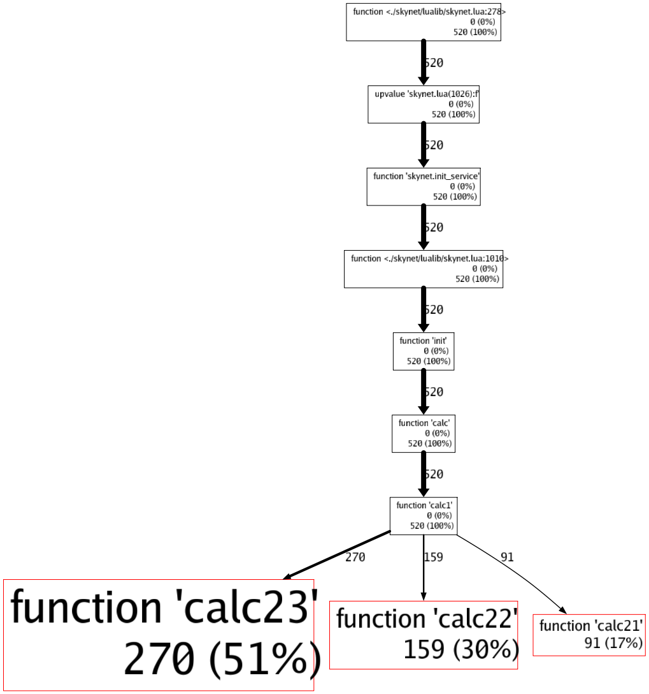

# skynet-perf
skynet snlua服务性能分析工具

## 特性
* 易使用，接口简单
* 轻量，对skynet源码无侵入
* 直观，可生成函数间调用关系视图及热点函数性能开销占比信息

## 注意事项
* 一个skynet进程，同一时间只能对一个服务进行性能分析采样
* 采样频率固定为50Hz，可通过PROF_HZ常量自行调整

## 编译 && 运行示例
* 将编译后的skynet仓库连接到工程目录下
```bash
# ln -sf $YOUR_SKYNET_PATH skynet
```
* 编译lperf.so
```bash
# make INCLUDE_DIR=skynet/3rd/lua
```
* 编译解析器pprof
```bash
# go get github.com/goccy/go-graphviz
# go build pprof.go
```
* 运行测试用例
```bash
# ./skynet/skynet test/calcsvr_config
```

## 分析示例采样结果
* 以文本形式查看所有热点函数（叶节点）性能开销占比（降序）
```bash
# ./pprof -i test_calc.pro -text
```
输出示例：
```
1th	    51%	    function 'calc23'
2th	    30%	    function 'calc22'
3th	    17%	    function 'calc21'
```
* 生成函数间调用关系及调用开销占比信息的png/svg图片
```bash
# ./pprof -i test_calc.pro -png test_calc.png
# ./pprof -i test_calc.pro -svg test_calc.svg
```
输出示例：

* 生成采样文件的源信息明细（通常用于调试）
```bash
# ./pprof -i test_calc.pro -info test_calc.txt
```
输出示例：
```bash
# cat test_calc.txt
FuncId	:	FuncName
3	:	function <./skynet/lualib/skynet.lua:278>
4	:	upvalue 'skynet.lua(1026):f'
5	:	function 'skynet.init_service'
6	:	function <./skynet/lualib/skynet.lua:1010>
7	:	function 'init'
8	:	function 'calc'
9	:	function 'calc1'
10	:	function 'calc23'
11	:	function 'calc22'
12	:	function 'calc21'
--------------------------------------------------------------------
Count	:	Backtrace
270	:	3 -> 4 -> 5 -> 6 -> 7 -> 8 -> 9 -> 10
159	:	3 -> 4 -> 5 -> 6 -> 7 -> 8 -> 9 -> 11
91	:	3 -> 4 -> 5 -> 6 -> 7 -> 8 -> 9 -> 12
```

## 参考
* https://github.com/esrrhs/pLua
* https://github.com/google/pprof